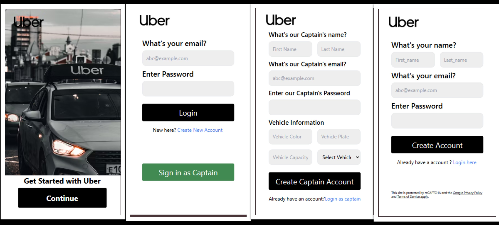
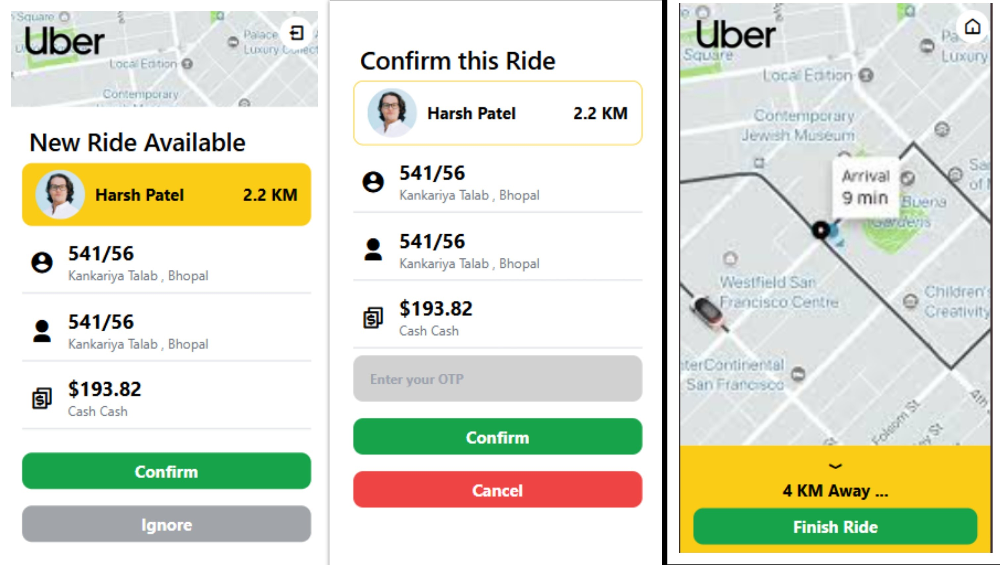
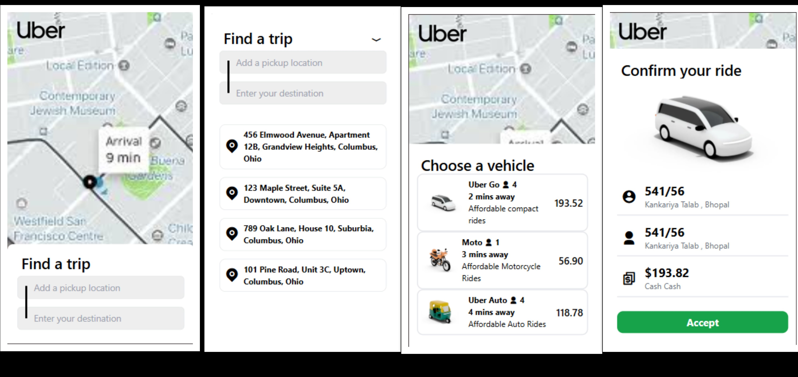

 UberViteApp




UberViteApp is a full-stack application that simulates the functionality of a ride-hailing service like Uber. The application consists of a backend server built with Node.js, Express, and MongoDB, and a frontend built with React and Vite.

## Table of Contents

- [Project Structure](#project-structure)
- [Backend](#backend)
  - [Environment Variables](#environment-variables)
  - [Endpoints](#endpoints)
    - [User Endpoints](#user-endpoints)
    - [Captain Endpoints](#captain-endpoints)
- [Frontend](#frontend)
- [Setup](#setup)
  - [Backend Setup](#backend-setup)
 

## Project Structure
## Backend

The backend server is built with Node.js, Express, and MongoDB. It handles user and captain authentication, registration, and other functionalities.

### Environment Variables

The backend server uses the following environment variables, which should be defined in a `.env` file:

### Endpoints

#### User Endpoints

- **POST /user/register**: Register a new user.
  - Request Body: `{ Fullname: { First_name, Last_name }, Email, Password }`
  - Response: `{ token, user }`

- **POST /user/login**: Login a user.
  - Request Body: `{ Email, Password }`
  - Response: `{ token, user }`

- **GET /user/profile**: Get the profile of the logged-in user.
  - Headers: `{ Authorization: Bearer <token> }`
  - Response: `{ user }`

- **GET /user/logout**: Logout the user.
  - Headers: `{ Authorization: Bearer <token> }`
  - Response: `{ message: "Successfully Logout" }`

#### Captain Endpoints
- **POST /captain/register**: Register a new captain.
  - Request Body: `{ fullname: { firstname, lastname }, email, password, vehicle: { color, plate, capacity, vehicleType } }`
  - Response: `{ token, captain }`

- **POST /captain/login**: Login a captain.
  - Request Body: `{ email, password }`
  - Response: `{ token, captain }`

- **GET /captain/profile**: Get the profile of the logged-in captain.
  - Headers: `{ Authorization: Bearer <token> }`
  - Response: `{ captain }`

- **GET /captain/logout**: Logout the captain.
  - Headers: `{ Authorization: Bearer <token> }`
  - Response: `{ message: "Successfully Logged out" }`

## Frontend

The frontend is built with React and Vite. It includes various components and pages for user and captain functionalities.

## Setup

### Backend Setup

1. Navigate to the `backendserver` directory:
   ```sh
   cd backendserver
## Frontend

The frontend is built with React and Vite. It includes various components and pages for user and captain functionalities.

### Functionalities

1. **User Authentication**: Users and captains can register and log in to the application. The authentication state is managed using context and tokens stored in `localStorage`.

2. **Ride Requests**: Users can request rides by specifying pickup and destination locations. Captains can see incoming ride requests and accept them.

3. **Ride Management**: Once a ride is accepted, both users and captains can see the ride details and track the ride status.

4. **User and Captain Profiles**: Users and captains can view and update their profiles, including personal details and vehicle information for captains.

5. **Logout Functionality**: Both users and captains can log out of the application, which clears the authentication token and redirects them to the login page.

6. **Animations**: The application uses GSAP for smooth animations, enhancing the user experience with transitions and pop-up animations.

### Components

- **RidePopUp**: Displays ride request details and allows the captain to accept the ride.
- **CaptainDetails**: Shows the captain's profile information and current status.
- **AcceptedRidePopUp**: Displays details of the accepted ride and allows the captain to manage the ride.
- **LocationSearchResults**: Provides search results for location inputs.
- **ConfirmedRide**: Shows the confirmed ride details to the user.
- **WaitingForDriver**: Displays a waiting screen for the user while a driver is being assigned.

## Setup
